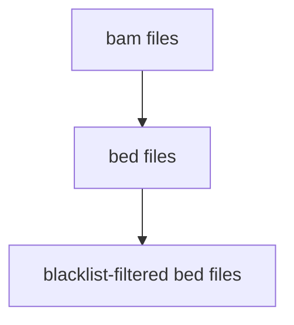

# Nextflow-pipeline-example

#### Introduction to how to create a basic nextflow pipeline using your own singularity container

---

#### tldr; how to run this pipeline
Clone the directory, then move to Nextflow_example directory and run the command below (provided you have singularity installed)
```
# may need to make nextflow executable using chmod
chmod 755 nextflow

# now run the pipeline
./nextflow run bam_to_bed.nf -with-singularity  bedtools.sif

# simplified direcotry structure of results/ after the run
results/
├── beds
│   ├── H3K27ac.bam.bed 
│   └── Input.bam.bed
└── filtered_beds
    ├── H3K27ac.bam.bed.filtered.bed
    └── Input.bam.bed.filtered.bed
```
---

This is a gentle introduction to creating a bare-minimum but still a (useful) genomics pipeline. I did not want to create another 'Hello world!' tutorial, as useful they are, but personally I don't find them very insightful in terms of implementing into genomics-ish application.

I am just getting started into learning nextflow pipeline creation and thought would be hopefully helpful to others (and myself) to catalogue all the bits and bobs of this process.


#### What does this pipeline do?
This pipeline takes bam files, converts them to bed, and then filters out noisy regions using a ChIP-seq blacklist file. This I believe is a good start to a small nextflow project, and deals with taking multiple inputs(step 1 below), makes intermediate files (bed files), and passes them on to the last step and outputs filtered bed files.




#### Nextflow file and logic
I have the contents of nextflow file below.

```

#!/usr/bin/env nextflow
nextflow.enable.dsl=2

params.input = "bams/*.bam"
params.blacklist_file = file("Final_blacklist_atlantic_salmon_devmap_bodymap_combined.bed")

process BAM_TO_BED {
    publishDir 'results/beds'

    input:
    path read
    
    output:
    file ("${read}.bed")

    script:
    """
    bedtools bamtobed -i $read  | awk 'OFS="\t" {print \$1, \$2, \$3,"",\$5, \$6}' > ${read}.bed
    """
}

process FILTER_BLACKLIST {
    publishDir 'results/filtered_beds'

    input:
    path read
    file blacklist_file

    output:
    file ("${read}.filtered.bed")

    script:
    """
    bedtools subtract -a $read -b $blacklist_file > ${read}.filtered.bed
    """
}

workflow {
    input_ch = Channel.fromPath(params.input)
    blacklist_file = params.blacklist_file
    BAM_TO_BED(input_ch)
    FILTER_BLACKLIST(BAM_TO_BED.out.flatten(), blacklist_file)
}

```
There are two main things to look into the nextflow file above

 - process: A process is a task that you want to achieve. For example, bam to bed conversion is a process. Obvious but just want to mention each process has information about the inputs, outputs,and the script (command) that takes in input files and generates output files.
 - workflow: A workflow block contains information about which processes will be run, it also has instructions in parentheses for input file. This one may seem a bit tricky but lets have a look at workflow above. In the beginning of the block, it tells the programme where to look for the input files (using info from params.input). Same way it tells the location of blacklist file, via another params. Then the execution of processes is catalogued. First, BAM_TO_BED process will be executed, the inputs for this are defined inside the parentheses (input_ch). And next, FILTER_BLACKLIST is executed, this one takes two types of input files: output of BAM_TO_BED, and a blacklist file. 
 
 
 #### How to create Singularity image/container (with custom tools installed inside it, e.g. bedtools for this project)
 
 I was really tempted to use Docker, but annoyingly Eddie doesn't support Docker. So singularity is the option, but need to first create container/image  with bedtools suite of tools.
- Installing singularity (on my laptop) using this: https://github.com/sylabs/singularity/blob/main/INSTALL.md
- Gentle intro to singularity container here: https://singularity-tutorial.github.io/02-basic-usage/
- I created container/image on my laptop and then scp them to Eddie to use cross-platform.
- Really useful link to create your own containter is here https://www.youtube.com/watch?v=Wtq1Aj5Zw-c&t=506s

Briefly, you need to install Singularity on your device and then search for the image here https://hub.docker.com/search?q=bedtools , copy the name and build using the command below.
```
# singularity build <name of the sif> <link to existing image on docker>
singularity build bedtools.sif docker://staphb/bedtools
```
